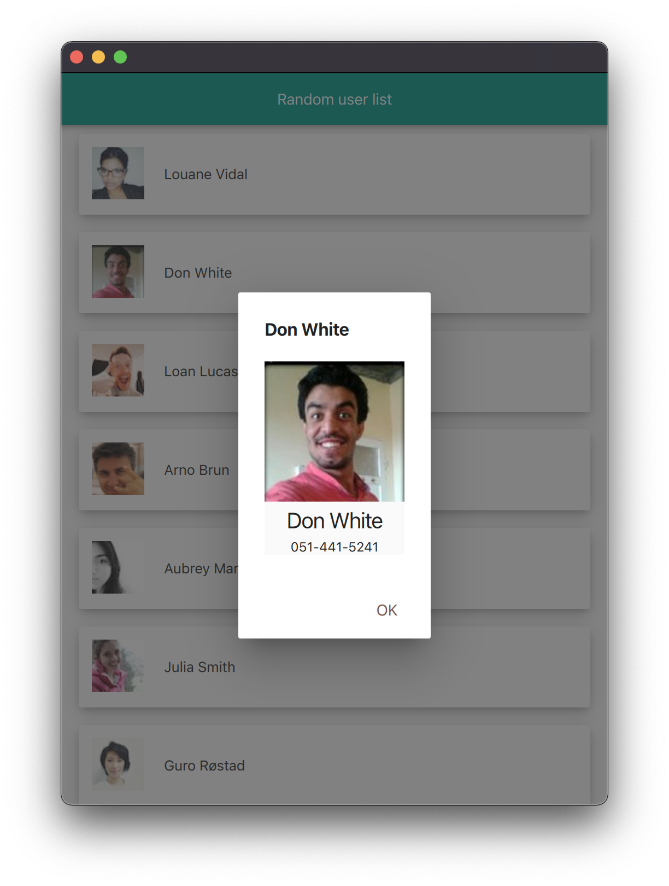
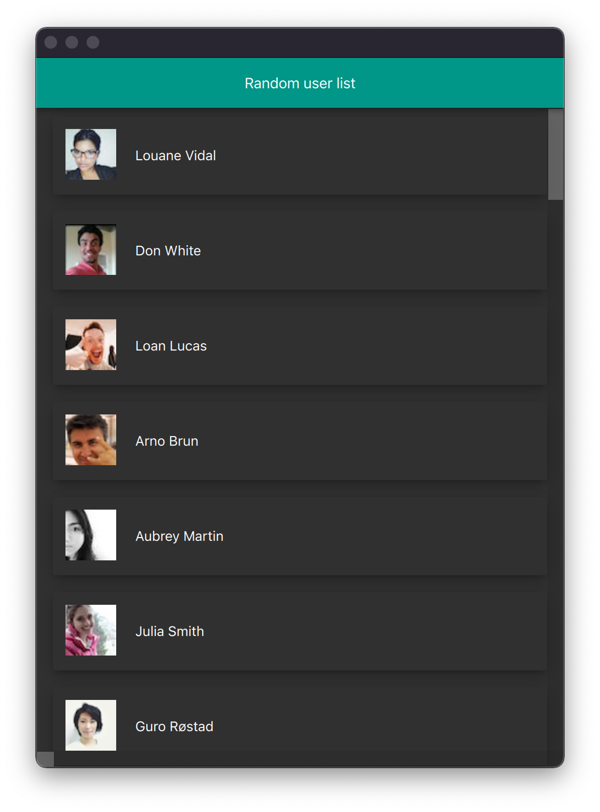
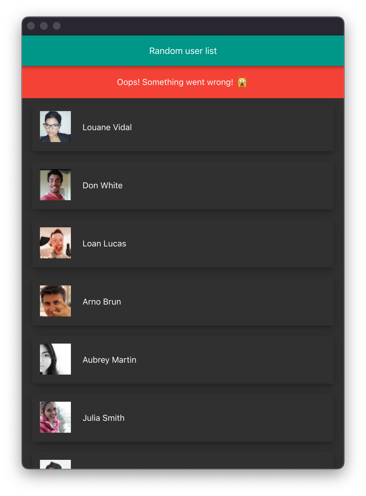

# User list Qt application

## Features
Displays a list of users from [Random User Generator](https://randomuser.me/documentation).

Tapping on a user in the list opens a details dialog.

Day mode:
|List|Detail|Error|
|---|---|---|
||||

Night mode:
|List|Detail|Error|
|---|---|---|
||||
